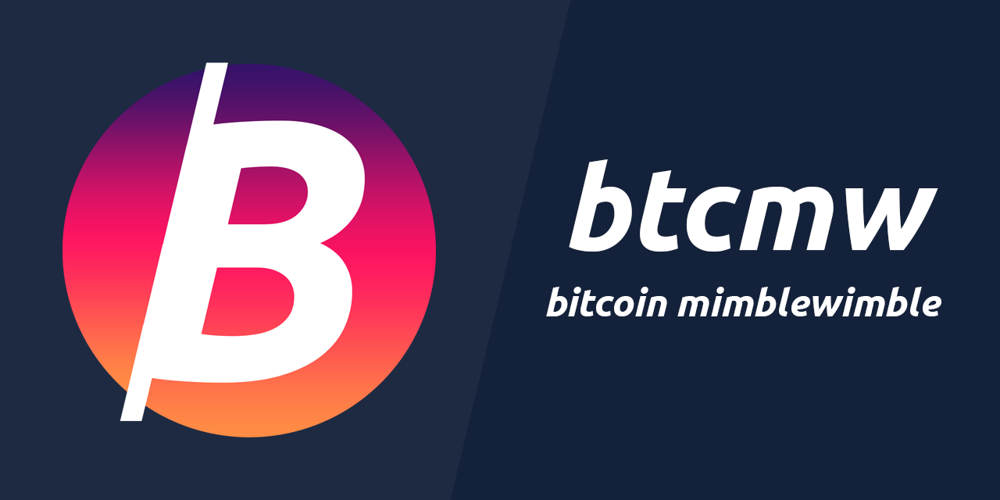

### Welcome to Bitcoin MW


Bitcoin MW is a next generation scalable, confidential cryptocurrency based on an elegant and innovative [Mimblewimble protocol](docs/Mimblewimble.pdf).

### GET STARTED


Get BTCMW binaries here: https://github.com/lucangogo/BTCMW/releases

If you build from source please use 'mainnet' branch\

Latest documentation is available in this git repo

Things that make Bitcoin MW special include:

* Users have complete control over privacy - a user decides which information will be available and to which parties, having complete control over his personal data in accordance to his will and applicable laws.
* Confidentiality without penalty - in BTCMW confidential transactions do not cause bloating of the blockchain, avoiding excessive computational overhead or penalty on performance or scalability while completely concealing the transaction value.
* No trusted setup required
* Blocks are mined using Equihash Proof-of-Work algorithm.
* Limited emission using periodic halving.
* No addresses are stored in the blockchain - no information whatsoever about either the sender or the receiver of a transaction is stored in the blockchain.
* Superior scalability through compact blockchain size - using the “cut-through” feature of
Mimblewimble makes the BTCMW blockchain orders of magnitude smaller than any other
blockchain implementation.
* BTCMW supports many transaction types such as escrow transactions, time locked
transactions, atomic swaps and more.
* No premine. No ICO. No dev coins.
* Implemented as a Beam derivative, written in C++.


### Current status

#### Mainnet(January 3rd 2019)

- Fully functional wallet with key generator and storage supporting secure and confidential online transactions.
- Full node with both transaction and block validation and full UTXO state management.
- Equihash miner with periodic mining difficulty adjustment.
- Batch Bulletproofs, the efficient non-interactive zero knowledge range proofs now in batch mode
- Graphical Wallet Application for Linux, Mac and Windows platforms
- Offline transactions using Secure BBS system
- ChainWork - sublinear blockchain validation, based on FlyClient idea by Loi Luu, Benedikt Bünz, Mahdi Zamani
- Compact history using cut through

#### Agile Atom (February 2019)

- Payment and Exchange APIs
- Mining Pool APIs
- Lightning Network position paper

#### Bright Boson 2.0 (March 2019)
- Payment proof
- Ultra fast sync
- Android Mobile wallet

#### Clear Cathode 3.0 (July 2019)
- PoW change (BeamHash II)
- Atomic Swaps CLI support
- Relative Time Locks and Laser Beam support

#### Double Doppler 4.0 (December 2019)
- Atomic Swaps desktop wallet support
- Sync mechanism improvements


See [How to build](https://github.com/BeamMW/beam/wiki/How-to-build)
### How To Build

Clone btcmw sources

```
git clone https://github.com/lucangogo/btcmw.git
```

Initalize submodules

```
cd btcmw
git submodule update --init --recursive
```

Ensure you have OpenSSL and CMake

```
# For Mac OS, install homebrew, then...
brew install openssl cmake
# .. and remove any brew installations of boost and qt5:
# If this errors saying "No such keg" that is expected and you can move forward
brew uninstall --ignore-dependencies qt boost
# Download and install a compatible boost:
curl -O https://raw.githubusercontent.com/Homebrew/homebrew-core/5da5895add2f6b9320d654dd844d4827f6876c8b/Formula/boost.rb
brew install ./boost.rb

# Download and install static qt5
sudo git clone --depth=1 https://github.com/nesbox/qt5-static-mac.git /usr/local/qt5-static


#Download and install QT5.11 from the official website http://master.qt.io/new_archive/qt/5.11/5.11.0/qt-opensource-mac-x64-5.11.0.dmg
# This will take a little while to fully install, by default you'll end up with a folder holding all the Qt files inside of /Users/<username>/Qt5.11.0

# Set environment variables for OpenSSL and Qt
export OPENSSL_ROOT_DIR="/usr/local/opt/openssl@1.1"

export PATH=/Users/<username>/Qt5.11.0/5.11.0/clang_64/bin:$PATH
export QT5_ROOT_DIR=/Users/<username>/Qt5.11.0/5.11.0/
export QML_IMPORT_PATH="/Users/<username>/Qt5.11.0/5.11.0/qml"

#export PATH=/usr/local/qt5-static/bin:$PATH
#export PATH="/usr/local/opt/qt/bin:$PATH"
```

Run CMake in the project folder

```
#cmake -DCMAKE_BUILD_TYPE=Release -DBEAM_LINK_TYPE=Static -DBRANCH_NAME=Mainnet .
#cmake -DCMAKE_BUILD_TYPE=Release .
cmake -DCMAKE_BUILD_TYPE=Release -DBRANCH_NAME=master -DBEAM_HOW_WALLET=Off .
make -j4
```

Use cpack to get .dmg file on Mac OS
Binaries are available in btcmw/wallet and btcmw/explorer subfolders
